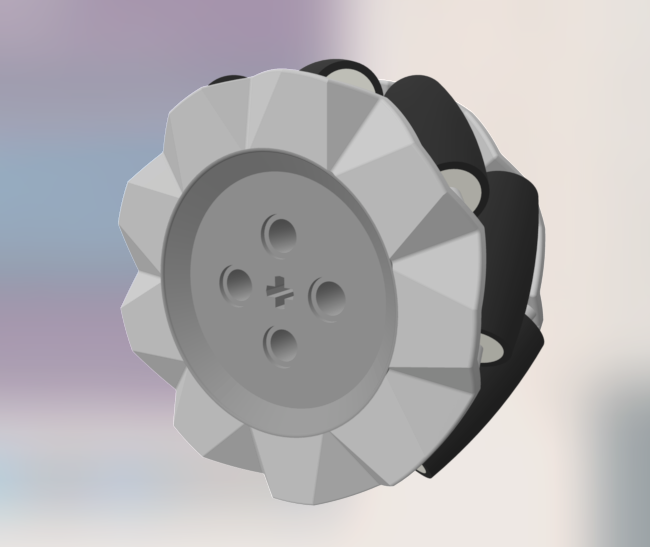
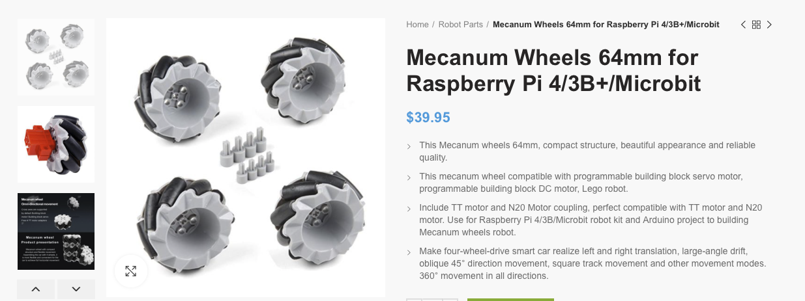
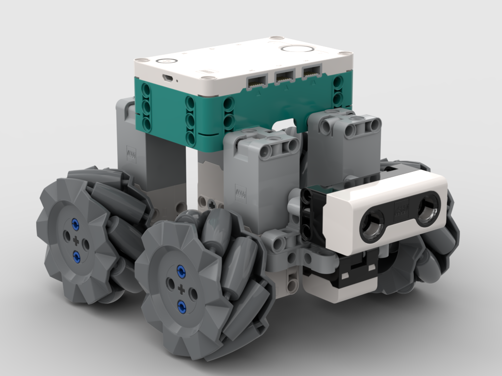
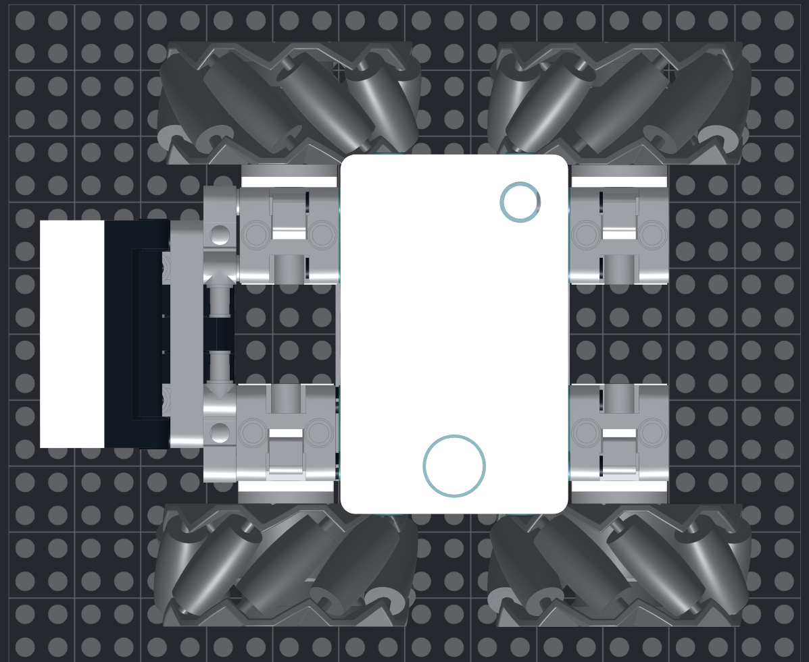

### Mecanum Wheels for Lego Robots 

This is a set of 64mm diameter [Mecanum wheels ](https://en.wikipedia.org/wiki/Mecanum_wheel) 
such as those available at:
[Unihobbytech](https://www.unihobbytech.com/p/mecanum-wheels-64mm-for-raspberry-pi-4-3b-microbit) and
numerous other places around the net.

They measure 64mm outside diameter, 30mm width, or about 8x3.125 studs.

Mecanum wheels come in chiral pairs, so there are two versions, a left-handed and right-handed twist
version.

This collection includes Step (.step) solid model files for import into Fusion 360 or Solidworks, Wavefront
mesh versions (.mtl and .obj) for import into Blender or 
[Bricklink Studio PartsDesigner](https://www.bricklink.com/v3/studio/partdesigner.page), as well as finished
PartsDesigner files (.part).

In addition, there is a [Bricklink Studio](https://www.bricklink.com/v3/studio/download.page) file rover.io
which is a finished robot demonstrating mecanum wheels.

Note that the arrangement of Mecanum wheels is important.  In this top-down view of the above rover, 
notice that the wheel rollers make an "X" shape.

There is a Collada file of the rover (mechbot.dae) intended for import into [ROS Gazebo](https://gazebosim.org/home)

There is a [gazebo mecanum plugin](https://github.com/qaz9517532846/gazebo_mecanum_plugins) available on github.

[Building models for ROS Gazebo](https://classic.gazebosim.org/tutorials?tut=build_model)

"Gazebo requires that mesh files be formatted as STL, Collada or OBJ, with Collada and OBJ being the preferred formats."

For information on the kinematics of mecanum wheels, see external_doc/kinematic_model_mechanum.pdf.

